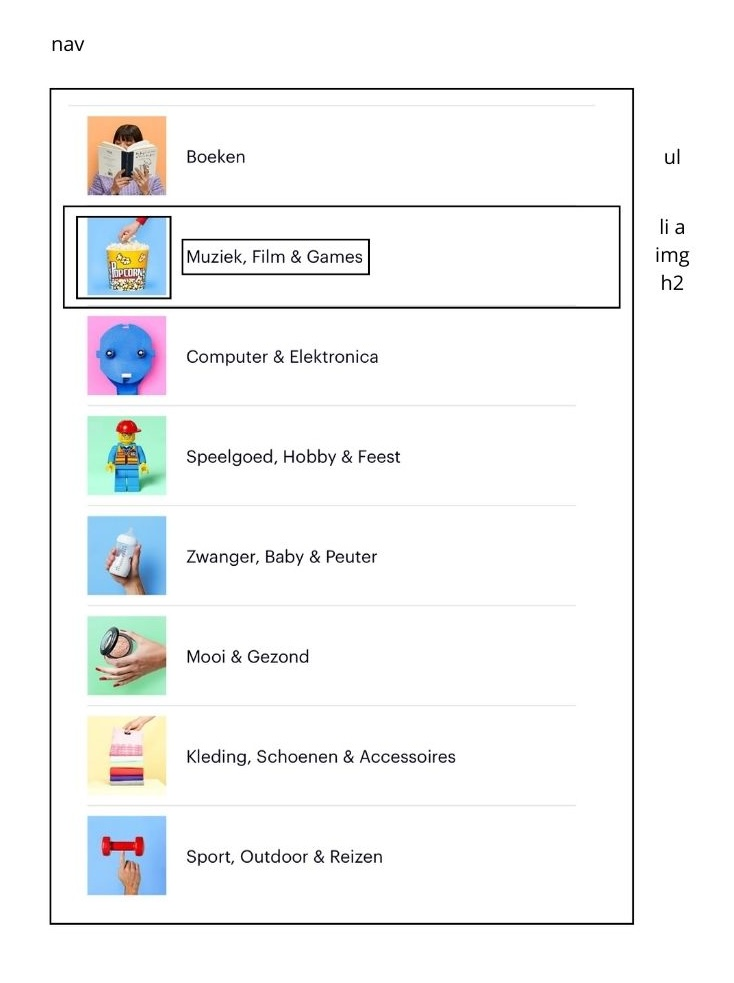

# Procesverslag
Markdown is een simpele manier om HTML te schrijven.  
Markdown cheat cheet: [Hulp bij het schrijven van Markdown](https://github.com/adam-p/markdown-here/wiki/Markdown-Cheatsheet).

Nb. De standaardstructuur en de spartaanse opmaak van de README.md zijn helemaal prima. Het gaat om de inhoud van je procesverslag. Besteedt de tijd voor pracht en praal aan je website.

Nb. Door *open* toe te voegen aan een *details* element kun je deze standaard open zetten. Fijn om dat steeds voor de relevante stuk(ken) te doen.

## Jij

  
uitwerken voor kick-off werkgroep

  ### Auteur:
  Carmen Brands

  #### Je startniveau:
  Blauw

  #### Je focus:
  Responsive 
 

## Je website

  
uitwerken voor kick-off werkgroep

  ### Je opdracht:
 (https://www.bol.com/nl/nl/)
  #### Screenshot(s) van de eerste pagina (small screen): 
  hier de naam van de pagina  
  
  

  #### Screenshot(s) van de tweede pagina (small screen):
  hier de naam van de pagina  
   

 
 

## Toegankelijkheidstest 1/2 (week 1)

  
uitwerken na test in 2e werkgroep

  ### Bevindingen
  Lijst met je bevindingen die in de test naar voren kwamen:
  
  #### Screenreader
  Hier korte omschrijving (met indien nodig afbeeldingen)
  Problemen:
  1. Als de screenreader tussen linkjes skipt, leest hij de productinformatie voor zowel op de afbeelding als het tekstje daaronder (dubbele informatie).
  2. Als de gebruiker een item in zijn winkelwagen doet, krijgt hij geen audio-feedback dat dit gelukt is.

  Hier een omschrijving van hoe het opgelost kan worden (met indien nodig afbeeldingen)
  1. Een aria-label toevoegen bij de linkjes (a-tags) van producten die ook een afbeelding bevatten en de alt-tekst van de afbeelding leeg laten.
  2. Automatische audio-feedback toevoegen.

  #### Muis en Toetsenbord 
  Hier korte omschrijving (met indien nodig afbeeldingen)
  Wat gaat goed:
  1. Focus state toont door omlijning waar de gebruiker zich op het scherm bevindt met voldoende contrast.
  2. Er zijn veel opties op de homepage, maar bol.com heeft genoeg ruimte per item gekozen zodat de gebruiker niet snel misklikt.
  
  Problemen:
  1. De navigatie opent niet als de gebruiker er met zijn tab-toets op staat en vervolgens op "enter" drukt.
  2. Geen feedback als de gebruiker hovered over: klikbare afbeeldingen, social media buttons en pijltje naar rechts om meer producten in de caroussel te bekijken.
  3. Geen feedback als de gebruiker op een knop klikt (active).
  

  Hier een omschrijving van hoe het opgelost kan worden (met indien nodig afbeeldingen)
  1. -
  2. Hover feedback toevoegen door bijvoorbeeld de kleur van het lettertype aan te passen, de gehele achtergrond van kleur te veranderen, vergroten van de tekst, tekst te omlijnen, etc.
  3. Active state toevoegen zodat gebruikers kunnen zien waar ze geklikt hebben.

## Breakdownschets (week 1)

  
uitwerken na afloop 3e werkgroep

  ### de hele pagina: 
  
  

  ### dynamisch deel (bijv menu): 
  

  ### wellicht nog een dynamisch deel (bijv filter): 
  

## Voortgang 1 (week 2)

  
uitwerken voor 1e voortgang

  ### Stand van zaken
  hier dit ging goed & dit was lastig (neem ook screenshots op van delen van je website en code)

  ### Agenda voor meeting
  samen met je groepje opstellen

  | student 1      | student 2          | student 3    | student 4        |
  | ---            | ---                | ---          | ---              |
  | dit bespreken  | en dit             | en ik dit    | en dan ik dat    |
  | en dat ook nog | dit als er tijd is | nog een punt | dit wil ik zeker |
  | ...            | ...                | ...          | ...              |

  ### Verslag van meeting
  hier na afloop snel de uitkomsten van de meeting vastleggen

  - punt 1
  - punt 2
  - nog een punt
  - ...

## Voortgang 2 (week 3)

  
uitwerken voor 2e voortgang

  ### Stand van zaken
  hier dit ging goed & dit was lastig (neem ook screenshots op van delen van je website en code)

  ### Agenda voor meeting
  samen met je groepje opstellen

  | student 1      | student 2          | student 3    | student 4        |
  | ---            | ---                | ---          | ---              |
  | dit bespreken  | en dit             | en ik dit    | en dan ik dat    |
  | en dat ook nog | dit als er tijd is | nog een punt | dit wil ik zeker |
  | ...            | ...                | ...          | ...              |

  ### Verslag van meeting
  hier na afloop snel de uitkomsten van de meeting vastleggen

  - punt 1
  - punt 2
  - nog een punt
- ...

## Toegankelijkheidstest 2/2 (week 4)

  
uitwerken na test in 9e werkgroep

  ### Bevindingen
  Lijst met je bevindingen die in de test naar voren kwamen (geef ook aan wat er verbeterd is):

## Voortgang 3 (week 4)

  
uitwerken voor 3e voortgang

  ### Stand van zaken
  hier dit ging goed & dit was lastig (neem ook screenshots op van delen van je website en code)

  ### Agenda voor meeting
  samen met je groepje opstellen

  | student 1      | student 2          | student 3    | student 4        |
  | ---            | ---                | ---          | ---              |
  | dit bespreken  | en dit             | en ik dit    | en dan ik dat    |
  | en dat ook nog | dit als er tijd is | nog een punt | dit wil ik zeker |
  | ...            | ...                | ...          | ...              |

  ### Verslag van meeting
  hier na afloop snel de uitkomsten van de meeting vastleggen

  - punt 1
  - punt 2
  - nog een punt
  - ...

## Eindgesprek (week 5)

  
uitwerken voor eindgesprek

  ### Je uitkomst - karakteristiek screenshots:
  

  ### Dit ging goed/Heb ik geleerd: 
  Korte omschrijving met plaatjes

  

  ### Dit was lastig/Is niet gelukt:
  Korte omschrijving met plaatjes

  

## Bronnenlijst

  
continu bijhouden terwijl je werkt

  Nb. Wees specifiek ('css-tricks' als bron is bijv. niet specifiek genoeg). 
  Nb. ChatGpT en andere AI horen er ook bij.
  Nb. Vermeld de bronnen ook in je code.

  1. bron 1
  2. bron 2
  3. ...

